# VerilogModels
在看《Verilog HDL高级数字设计》、《手把手教你设计CPU RISC-V处理器篇》、《CPU设计实战CPU Design and Practice》和实践过程中对书中的一些'最佳实践'也有一定的疑惑。

因此分别使用3种Verilog描述方式对几种基本的电路进行描述，然后使用EDA软件（ModelSim、Vivado）进行分析和综合，对比不同的描述方式之间的差异作为笔记。

（下面是从我本地Obsidian笔记中复制的内容）

# notes
https://zhuanlan.zhihu.com/p/678901937

Verilog作为硬件描述语言 (Hardware Description Language, HDL)，就是用来描述电路
根据不同的抽象层次，可以分为不同的描述方式（模型）


- 结构化表述方式 （结构模型，Structural Modeling）
- 数据流描述方式 （数据模型，Dataflow Modeling）
- 行为级描述方式 （行为模型，Behavior Modeling）

在实践中，往往都是3种方式混用，这样既可以保证一定的抽象程度，使得大规模电路设计成为现实，同时也能让设计人员对底层电路有一定了解，以便对电路进行面积和速度上的优化。
## 结构化描述方式
抽象层次最低，最接近底层电路
```verilog
module structural (
    input wire A,
    input wire B,
    output wire C
);
and and_test(C, A, B);
endmodule
```

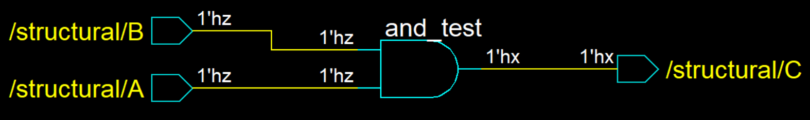


## 数据流描述方式
比结构化表述方式的抽象级别高一些，因为不需要直接描述电路的底层实现方式
只需对数据是如何流动的这一现象进行描述，从而实现电路功能
```verilog
module dataflow (
    input wire A1,
    input wire B,
    output wire C
);
assign C = A1 & B;
endmodule
```
原本需要用门电路搭建的电路只需要用 '&‘运算符即可实现，而具体的实现方式则由综合工具进行映射
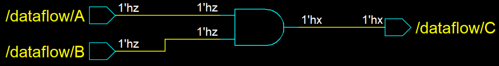


## 行为级描述方式
是抽象级别最高的描述方式，多用于大型设计
```verilog
module behavior (
    input wire A,
    input wire B,
    output reg C
);
always @(*) begin
    if (A == 1'b1 && B == 1'b1) begin
        C = 1'b1;
    end 
    else begin
        C = 1'b0;
    end
end
endmodule
```
描述电路的行为：只有当A和B同时为1时，输出才为1，其他情况为0
行为级描述不需要抽象出电路的具体实现，也不需要管数据的流动路径，只需要对电路的外在表现，即电路的具体行为进行描述即可。
这种方式抽象级别最高，概括能力最强。
但也有缺点，就是太抽象了。很多时候不能直接与硬件电路联系起来。
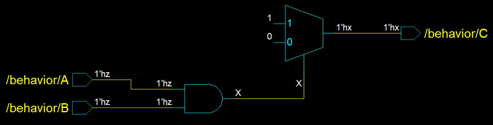


## Vivado原理图对比
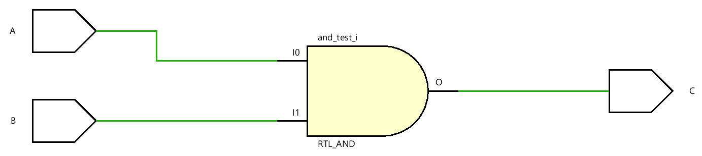
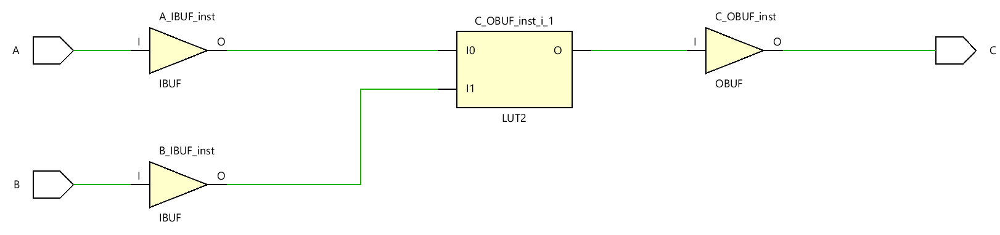

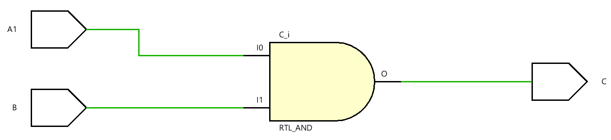
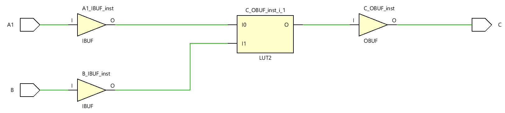

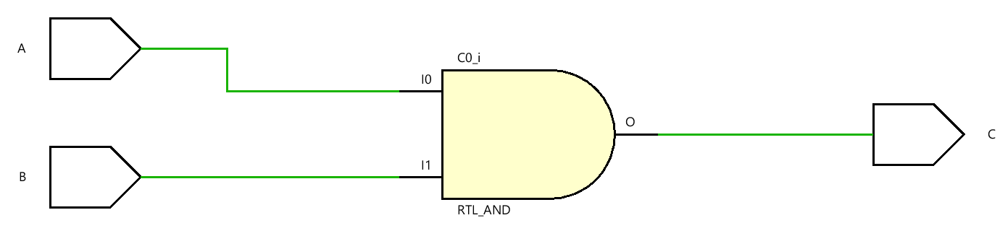
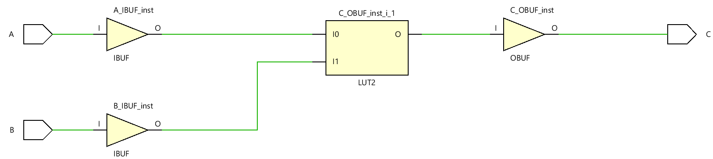


# 半加器例子
```verilog
module structural (
    input   A,
    input   B,
    output  S,
    output  C
);
xor s(S, A, B);
and c(C, A, B);
    
endmodule
```
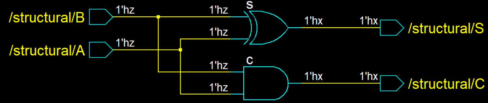

```verilog
module dataflow (
    input   A,
    input   B,
    output  S,
    output  C
);
assign S = A ^ B;
assign C = A & B;
    
endmodule
```
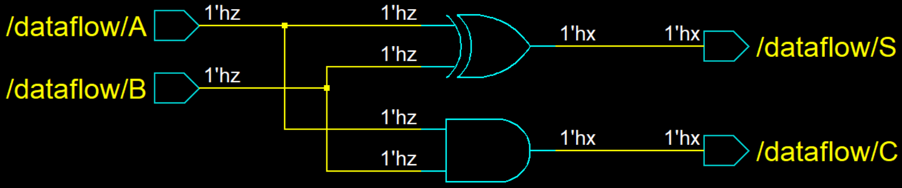


```verilog
module behavior (
    input   A,
    input   B,
    output  S,
    output  C
);
assign {C, S} = A + B;
    
endmodule
```
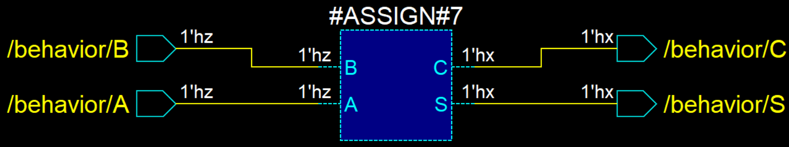

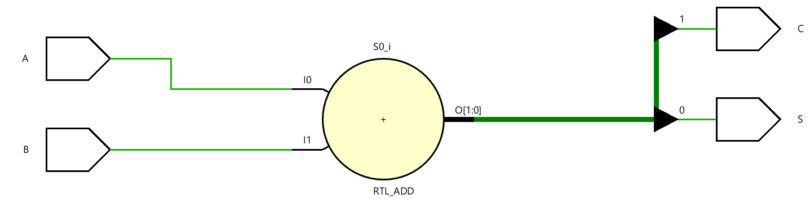
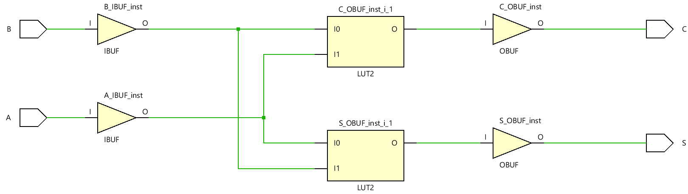


# Mux
## dataflow
```verilog
module dataflow ( 
    input [7:0] in1, 
    input [7:0] in2, 
    input [7:0] in3, 
    input [7:0] in4, 
    input [1:0] sel, 
    output wire [7:0] q 
);
    assign q = ({8{sel == 2'd0}} & in1) | ({8{sel == 2'd1}} & in2) | ({8{sel == 2'd2}} & in3) | ({8{sel == 2'd3}} & in4);
endmodule

```

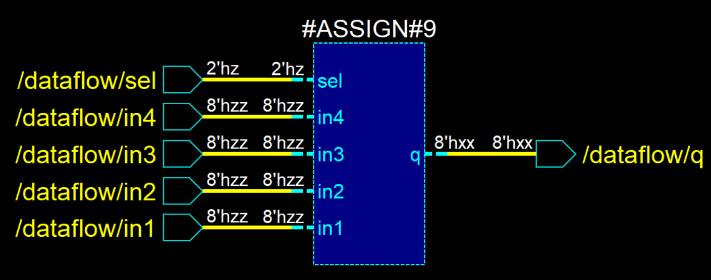
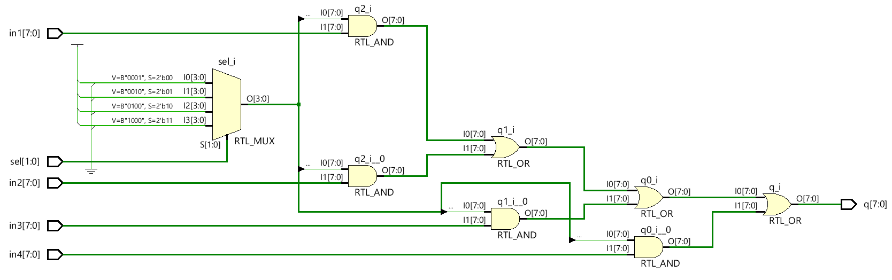

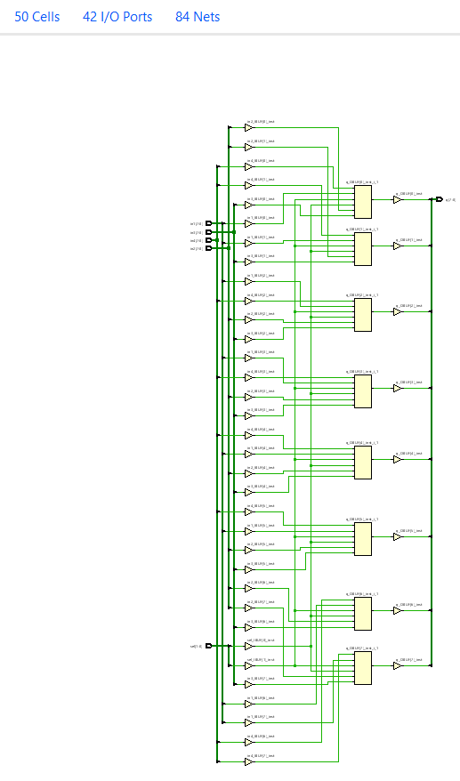


## behavior
```verilog
module behavior ( 
    input [7:0] in1, 
    input [7:0] in2, 
    input [7:0] in3, 
    input [7:0] in4, 
    input [1:0] sel, 
    output reg [7:0] q 
);

	always @(*)	begin
		case(sel)
			2'h0: q = in1;
			2'h1: q = in2;
			2'h2: q = in3;
			2'h3: q = in4;
		endcase
    end
endmodule
```
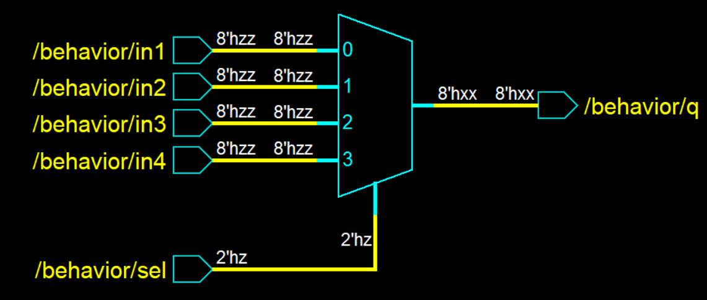
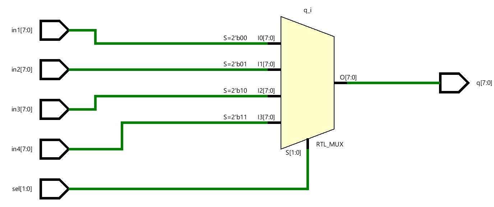

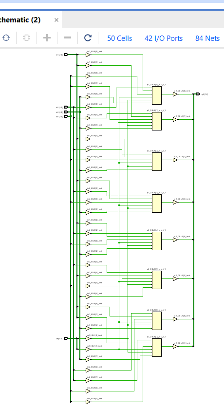


